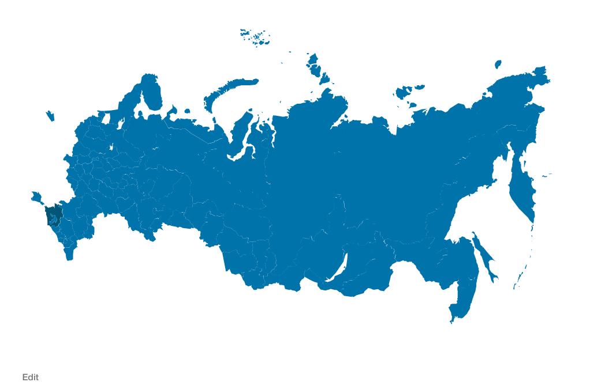

ⓦ Russian regions as post on svg map 

=======================  
  
## WordPress Плагин  

 * *Внешний вид шоткода выводящего карту*  
## Описание

Добавляет каталог со списком регионов РФ которые можно вывести в виде svg карты  со ссылками на каждый регион
  
## Установка  

 1. Устанавливаем плагин любым доступным способом
 2. Импортируем регионы России из файла `wp-russia-regions-as-post/regions_data.xml`
 
## Использование 
Можно вывести все регионы при помощи шорткода вот так:
`[wp_russia_regions_map region_numbers_highlight='77']`
Атрибут `region_numbers_highlight` отвечает за подсветку определенного региона на карте, в качестве номера региона можно использовать любой из  [автокодов](https://ru.wikipedia.org/wiki/%D0%A0%D0%B5%D0%B3%D0%B8%D1%81%D1%82%D1%80%D0%B0%D1%86%D0%B8%D0%BE%D0%BD%D0%BD%D1%8B%D0%B5_%D0%B7%D0%BD%D0%B0%D0%BA%D0%B8_%D1%82%D1%80%D0%B0%D0%BD%D1%81%D0%BF%D0%BE%D1%80%D1%82%D0%BD%D1%8B%D1%85_%D1%81%D1%80%D0%B5%D0%B4%D1%81%D1%82%D0%B2_%D0%B2_%D0%A0%D0%BE%D1%81%D1%81%D0%B8%D0%B8) региона.

На страницах регионом положение карты в контенте можно изменить по средствам фильтра `wp_russia_regions_as_post_add_region_map`.

## Редактирование

Не смотря на то что в новейшей истории РФ есть прецеденты присоединения новых регионов интерфейс для этого действия не предусмотрен виду того что рисовать новые регионы в векторе сложно и регионы присоединяются достаточно редко, если это потребуется я просто обновлю плагин. Зато удаление регионов реализовано стандартными средствами WordPress, я не к чему не призываю но просто удаляем пост по необходимости.

## P.S.

Если вашего региона нет на карте пишите в Issues.
В личной беседе [@soulseekah](https://github.com/soulseekah) высказывал предположение что такой масштабный проект нуждается в unit тестах, поэтому будем ждать помощи сообщества в нелегком деле написания тестов.

## UPD 

Плагин [добавлен](https://wordpress.org/plugins/russian-regions-as-post-on-svg-map/) в официальный репозиторий на wordpress.org.
